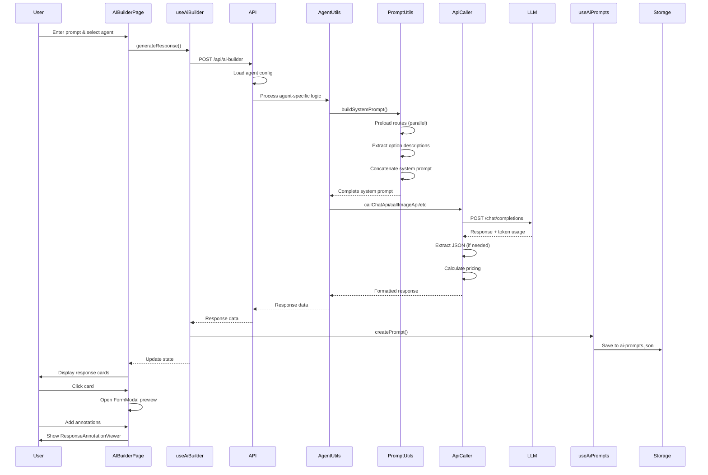
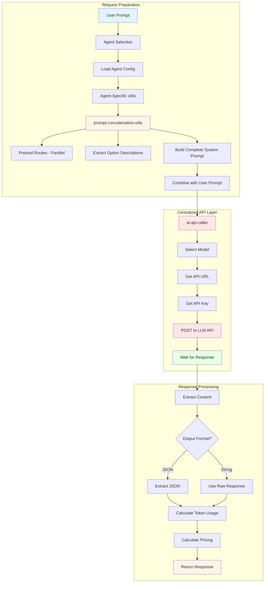

# AI Builder Architecture Documentation

## Overview

The AI Builder is a comprehensive system that enables users to generate structured content (like JSON schemas) using Large Language Models (LLMs). It provides an intuitive interface for creating prompts, managing AI agents, tracking usage, and reviewing history.

## System Architecture

```mermaid
graph TB
    subgraph "Client Layer"
        A[AI Builder Page] --> B[useAiBuilder Hook]
        A --> C[ResponseCardViewer]
        A --> D[ResponseAnnotationViewer]
        A --> E[FormModal Preview]
        F[AI Prompts Page] --> G[useAiPrompts Hook]
        F --> H[AiPromptHistory Component]
    end

    subgraph "Domain Layer"
        B --> I[useAiAgents Hook]
        B --> J[useAiPrompts Hook]
        I --> K[ai-agents.json]
        J --> L[ai-prompts.json]
    end

    subgraph "API Layer"
        B --> M[/api/ai-builder]
        G --> N[/api/ai-prompts]
        I --> O[/api/ai-agents]
        M --> P[LLM API Service]
    end

    subgraph "External Services"
        P --> Q[OpenAI API]
        P --> R[OpenRouter API]
        P --> S[AvalAI API]
        P --> T[Other LLM Providers]
    end

    subgraph "Data Layer"
        K --> U[File System]
        L --> U
        V[application-variables.json] --> U
    end

    style A fill:#e1f5ff
    style F fill:#e1f5ff
    style M fill:#fff4e6
    style P fill:#ffe6e6
    style Q fill:#e6ffe6
    style R fill:#e6ffe6
    style S fill:#e6ffe6
```

## Component Flow



## Data Flow


## AI Agent Configuration


## LLM Integration Architecture



## Response Cards & Annotations Flow


## File Structure

```
src/
├── domains/
│   ├── ai-builder/
│   │   ├── components/
│   │   │   ├── AiBuilderForm.tsx          # Main form component
│   │   │   ├── AiBuilderResponse.tsx      # Response display
│   │   │   ├── ResponseCardViewer.tsx     # Schema cards
│   │   │   ├── ResponseAnnotationViewer.tsx # Annotations manager
│   │   │   ├── MessageDisplay.tsx         # Error/success messages
│   │   │   └── PromptPreviewSheet.tsx     # Prompt preview
│   │   ├── hooks/
│   │   │   ├── useAiBuilder.ts            # Main builder hook
│   │   │   └── useAiAgents.ts             # Agent management
│   │   ├── utils/
│   │   │   ├── prompt-concatenation-utils.ts # Centralized prompt building
│   │   │   ├── ai-api-caller.ts           # Centralized API calling
│   │   │   ├── ai-chat-utils.ts           # Chat agent processor
│   │   │   ├── ai-graph-utils.ts          # Graph agent processor
│   │   │   ├── ai-image-utils.ts          # Image agent processor
│   │   │   ├── ai-video-utils.ts          # Video agent processor
│   │   │   ├── ai-voice-utils.ts          # Voice agent processor
│   │   │   ├── ai-general-utils.ts        # General system prompts
│   │   │   ├── ai-common-utils.ts         # Shared utilities
│   │   │   ├── ai-security-utils.ts       # Security utilities
│   │   │   └── ai-shared-utils.ts         # Shared agent utilities
│   │   └── types/
│   │       └── index.ts                   # TypeScript types
│   └── ai-prompts/
│       ├── components/
│       │   └── AiPromptHistory.tsx        # History viewer
│       └── hooks/
│           └── useAiPrompts.ts            # Prompts management
├── gradian-ui/
│   └── form-builder/
│       └── form-elements/
│           └── utils/
│               └── option-extractor.ts     # Option description extraction
├── app/
│   ├── ai-builder/
│   │   └── page.tsx                      # Main builder page
│   ├── ai-prompts/
│   │   └── page.tsx                      # Prompts history page
│   └── api/
│       ├── ai-builder/
│       │   └── route.ts                  # LLM API endpoint
│       └── ai-prompts/
│           └── route.ts                  # Prompts CRUD API
└── data/
    ├── ai-agents.json                    # Agent configurations
    ├── ai-prompts.json                   # Prompt history
    └── application-variables.json        # App config (LLM API URL)
```

## Key Components

### 1. AI Builder Page (`/ai-builder`)

The main interface where users interact with AI agents to generate content.

**Features:**
- Agent selection dropdown
- Prompt input with auto-resize
- System prompt preview
- Response cards for generated schemas
- Form preview modal with annotations
- Annotation management
- Token usage and pricing display
- Approve/Submit actions

**Components:**
- `AiBuilderForm`: Input form with agent selection
- `AiBuilderResponse`: Displays AI response with cards and code viewer
- `ResponseCardViewer`: Shows clickable cards for each generated schema
- `ResponseAnnotationViewer`: Manages annotations across all schemas
- `FormModal`: Preview modal with form and annotation section
- `PromptPreviewSheet`: Displays system and user prompts (uses centralized `buildSystemPrompt()`)

### 2. AI Prompts Page (`/ai-prompts`)

A comprehensive history viewer for all AI prompts and responses.

**Features:**
- **Search & Filter:**
  - Search by prompt text or response content
  - Filter by AI agent
  - Filter by user
  - Date range filtering
  - Real-time search updates

- **Display:**
  - Expandable prompt cards
  - Code viewer for responses
  - Token usage metrics
  - Pricing information
  - Response time tracking
  - Copy to clipboard functionality

- **Metrics:**
  - Total tokens used
  - Total cost
  - Average response time
  - Token breakdown (input/output)
  - Cost breakdown

- **User Experience:**
  - Expandable/collapsible cards
  - Responsive design
  - Loading states
  - Error handling
  - Empty states

**Components:**
- `AiPromptHistory`: Main history component with filters
- `MetricCard`: Displays usage statistics
- `CodeViewer`: Syntax-highlighted code display

## API Endpoints

### POST `/api/ai-builder`

Generates AI responses using configured LLM providers.

**Request:**
```json
{
  "userPrompt": "Create a project management schema",
  "agentId": "app-builder"
}
```

**Response:**
```json
{
  "success": true,
  "data": {
    "response": "{...}",
    "format": "json",
    "tokenUsage": {
      "prompt_tokens": 150,
      "completion_tokens": 500,
      "total_tokens": 650,
      "pricing": {
        "input_cost": 0.0001,
        "output_cost": 0.0005,
        "total_cost": 0.0006,
        "model_id": "gpt-4o-mini"
      }
    },
    "timing": {
      "responseTime": 1200,
      "duration": 1500
    }
  }
}
```

**Process:**
1. Load agent configuration from `ai-agents.json`
2. Route to agent-specific processor (`ai-chat-utils`, `ai-image-utils`, etc.)
3. Agent processor calls `prompt-concatenation-utils.buildSystemPrompt()`:
   - Fetches preload routes in parallel (if configured)
   - Extracts option descriptions from formValues or bodyParams
   - Concatenates: general prompt → agent prompt → option descriptions → preload context
4. Agent processor calls centralized `ai-api-caller`:
   - `callChatApi()` for chat/graph agents
   - `callImageApi()` for image generation
   - `callVideoApi()` for video generation
   - `callVoiceApi()` for voice transcription
5. API caller handles: API key, error parsing, timing, token usage, pricing
6. Extract and process response (JSON extraction if needed)
7. Return formatted response

### GET `/api/ai-prompts`

Retrieves prompt history with optional filters.

**Query Parameters:**
- `username`: Filter by user
- `aiAgent`: Filter by agent ID
- `startDate`: Start date filter
- `endDate`: End date filter
- `search`: Search query

### POST `/api/ai-prompts`

Saves a new prompt to history.

**Request:**
```json
{
  "username": "user@example.com",
  "aiAgent": "app-builder",
  "userPrompt": "Create a schema...",
  "agentResponse": "{...}",
  "inputTokens": 150,
  "outputTokens": 500,
  "totalTokens": 650,
  "inputPrice": 0.0001,
  "outputPrice": 0.0005,
  "totalPrice": 0.0006
}
```

## Agent Configuration

Agents are defined in `data/ai-agents.json`:

```json
{
  "id": "app-builder",
  "label": "App Builder",
  "icon": "Sparkles",
  "description": "Generates complete app builder schemas",
  "requiredOutputFormat": "json",
  "model": "gpt-4o-mini",
  "systemPrompt": "Act as an experienced product manager...",
  "preloadRoutes": [
    {
      "route": "/api/schemas",
      "title": "Existing Schemas",
      "method": "GET",
      "jsonPath": "data",
      "queryParameters": {
        "summary": "true"
      }
    }
  ],
  "responseCards": [
    {
      "idPath": "$.id",
      "labelPath": "$.singular_name",
      "iconPath": "$.icon",
      "actionType": "openFormModal",
      "schemaPath": "$"
    }
  ],
  "nextAction": {
    "label": "Approve Response",
    "icon": "CheckCircle2",
    "route": "/api/schemas"
  }
}
```

## Centralized Utilities Architecture

The AI Builder uses a centralized architecture for scalability and maintainability:

### 1. Prompt Concatenation Utils (`prompt-concatenation-utils.ts`)

Centralizes all system prompt building logic:

**Functions:**
- `buildSystemPrompt()`: Builds complete system prompt with proper concatenation order
- `extractOptionDescriptionsFromBodyParams()`: Extracts descriptions from direct API calls
- `extractOptionDescriptionsFromAnySource()`: Unified extraction from formValues or bodyParams

**Concatenation Order:**
1. General system prompt (date/time context from `ai-general-utils.ts`)
2. Agent-specific system prompt
3. Option descriptions (from selected form options)
4. Additional system prompt (if provided via agent config)
5. Graph generation prompt (for graph agents)
6. General markdown output rules (for string format agents)
7. Preloaded context (from preload routes - fetched in parallel)

**Features:**
- Handles both form-based and direct API calls
- Extracts option descriptions from IDs in bodyParams
- Ensures prompt preview matches actual LLM prompt

### 2. AI API Caller (`ai-api-caller.ts`)

Centralizes all LLM API calling logic:

**Functions:**
- `callChatApi()`: Chat and graph generation API calls
- `callImageApi()`: Image generation API calls
- `callVideoApi()`: Video generation API calls
- `callVoiceApi()`: Voice transcription API calls
- `callGenericApi()`: Generic API caller with common logic

**Common Features:**
- API key management
- Error parsing and sanitization
- Request timing
- Token usage tracking
- Pricing calculation
- Model caching (5-minute TTL)
- Abort controller for timeouts

### 3. Agent-Specific Processors

Each agent type has a dedicated processor that:
- Validates agent configuration
- Extracts parameters from formValues or bodyParams
- Calls `buildSystemPrompt()` for prompt generation
- Calls appropriate `ai-api-caller` function
- Processes response format (JSON extraction, etc.)

**Processors:**
- `ai-chat-utils.ts`: Chat agents
- `ai-graph-utils.ts`: Graph generation agents
- `ai-image-utils.ts`: Image generation agents
- `ai-video-utils.ts`: Video generation agents
- `ai-voice-utils.ts`: Voice transcription agents

## Preload Routes

Preload routes allow agents to fetch context data before generating responses:

1. **Route Configuration:**
   - `route`: API endpoint path
   - `method`: HTTP method (GET/POST)
   - `queryParameters`: Query string parameters
   - `body`: Request body (for POST)
   - `jsonPath`: JSON path to extract data

2. **Process:**
   - Routes are fetched in parallel inside `prompt-concatenation-utils.ts`
   - Data is extracted using JSON paths
   - Formatted into system prompt context
   - Included in LLM request
   - Errors are logged but don't block prompt generation

## Response Cards

Response cards enable users to preview generated schemas:

1. **Configuration:**
   - JSON paths to extract card data
   - Support for single objects and arrays
   - Icon and label extraction

2. **Features:**
   - Click to preview in form modal
   - Visual card display with icons
   - Handles multiple schemas in array responses

## Annotations System

Annotations allow users to add notes to generated schemas:

1. **Components:**
   - `ListInput`: Drag-and-drop annotation list
   - Inline editing and deletion
   - Reordering support

2. **Flow:**
   - Add annotations in preview modal
   - Manage all annotations in `ResponseAnnotationViewer`
   - Apply button shows summary dialog

## Token Usage & Pricing

The system tracks and calculates:

1. **Token Metrics:**
   - Input tokens (prompt)
   - Output tokens (completion)
   - Total tokens

2. **Pricing:**
   - Model-specific pricing from `ai-models.json`
   - Cost per million tokens (input/output)
   - Total cost calculation
   - Real-time cost display

3. **Display:**
   - `MetricCard` component
   - Token breakdown
   - Cost breakdown
   - Model information

## Error Handling


## State Management


## Security Considerations

1. **API Keys:**
   - Stored in environment variables
   - Never exposed to client
   - Server-side only access

2. **Input Validation:**
   - Prompt length limits
   - JSON validation
   - Agent ID validation

3. **Error Handling:**
   - Graceful error messages
   - No sensitive data exposure
   - Request cancellation support

## Performance Optimizations

1. **Preload Routes:**
   - Parallel fetching (all routes fetched simultaneously)
   - Error tolerance (failed routes don't block prompt generation)
   - Integrated into prompt building flow

2. **Centralized API Calling:**
   - Model caching (5-minute TTL) to avoid repeated API calls
   - Efficient token usage calculation
   - Request timeout handling with abort controllers
   - Batch pricing calculations

3. **Response Processing:**
   - Async JSON extraction
   - Efficient token calculation
   - Minimal re-renders

4. **UI Optimizations:**
   - Lazy loading
   - Memoization
   - Debounced search
   - Prompt preview uses same building logic as actual requests

## Future Enhancements

1. **Streaming Responses:**
   - Real-time token streaming
   - Progressive rendering

2. **Advanced Annotations:**
   - Rich text annotations
   - Annotation templates
   - Export annotations

3. **Agent Marketplace:**
   - Shareable agent configs
   - Community agents
   - Agent versioning

4. **Analytics:**
   - Usage dashboards
   - Cost tracking
   - Performance metrics

## Related Documentation

- [Schema Builder Architecture](../../schema/SCHEMA_BUILDER_UPDATES.md)
- [Dynamic CRUD Architecture](../../architecture/DYNAMIC_CRUD_ARCHITECTURE.md)
- [Form Builder Documentation](../../gradian-ui/form-builder/docs/README.md)

