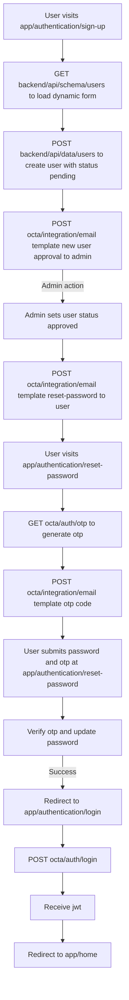

# Authentication Flow Documentation

This document describes the complete authentication flow for the Gradian application, including user registration, approval, password reset, and login processes.

## Overview

The authentication system follows a multi-stage approval process where:
1. New users register and are created with a `pending` status
2. Administrators approve new user accounts
3. Approved users receive password reset instructions
4. Users set their password using OTP verification
5. Users can then log in with their credentials

## Complete Authentication Flow

### Phase 1: User Registration

#### Step 1: User Visits Sign-Up Page
- **Route**: `app/authentication/sign-up`
- **Description**: User navigates to the sign-up page to create a new account

#### Step 2: Load Dynamic Form Schema
- **Endpoint**: `GET backend/api/schema/users`
- **Description**: Fetches the user schema to dynamically render the registration form
- **Response**: Returns the schema definition with form fields, validation rules, and field types

#### Step 3: Create User Account
- **Endpoint**: `POST backend/api/data/users`
- **Description**: Creates a new user account with the submitted form data
- **Request Body**: User registration data (name, email, etc.)
- **Response**: 
  - `success: true` - User created successfully
  - User object with `status: "pending"`
- **Note**: The user account is created but cannot log in until approved by an administrator

#### Step 4: Notify Administrator
- **Endpoint**: `POST octa/integration/email template new user approval`
- **Description**: Sends an email notification to administrators about the new user registration
- **Email Template**: "new user approval"
- **Purpose**: Alerts admins that a new user requires approval

### Phase 2: Administrator Approval

#### Step 5: Admin Approves User
- **Action**: Administrator sets user status to `approved`
- **Description**: Admin updates the user record, changing the status from `pending` to `approved`
- **Note**: This can be done through the admin interface or directly via API

#### Step 6: Send Password Reset Email
- **Endpoint**: `POST octa/integration/email template reset-password`
- **Description**: Sends a password reset email to the newly approved user
- **Email Template**: "reset-password"
- **Purpose**: Provides the user with instructions to set their initial password

### Phase 3: Password Reset with OTP

#### Step 7: User Visits Reset Password Page
- **Route**: `app/authentication/reset-password`
- **Description**: User navigates to the password reset page after receiving the email

#### Step 8: Generate OTP Code
- **Endpoint**: `GET octa/auth/otp`
- **Alternative Endpoint**: `POST /api/auth/2fa/generate` (as implemented in codebase)
- **Description**: Generates a one-time password (OTP) for the user
- **Request**: 
  - `userId`: User identifier (email or username)
  - `clientId`: Client ID for authentication
  - `secretKey`: Secret key for authentication
  - `ttlSeconds`: Time-to-live for the OTP (default: 300 seconds)
- **Response**:
  - `success: true`
  - `data.code`: The 6-digit OTP code
  - `data.expiresAt`: Expiration timestamp
  - `data.ttlSeconds`: Time-to-live in seconds

#### Step 9: Send OTP via Email
- **Endpoint**: `POST octa/integration/email template otp code`
- **Description**: Sends the generated OTP code to the user via email
- **Email Template**: "otp-code"
- **Email Content**: Contains the OTP code and expiration information

#### Step 10: User Submits Password and OTP
- **Route**: `app/authentication/reset-password`
- **Description**: User enters their new password and the OTP code received via email
- **Form Fields**:
  - Username/Email
  - OTP Code
  - New Password
  - Confirm Password

#### Step 11: Verify OTP and Update Password
- **Endpoint**: `POST /api/auth/password/reset`
- **Description**: Verifies the OTP code and updates the user's password
- **Request Body**:
  ```json
  {
    "username": "user@example.com",
    "code": "123456",
    "password": "newSecurePassword",
    "confirmPassword": "newSecurePassword"
  }
  ```
- **Validation**:
  - OTP code must be valid and not expired
  - Passwords must match
  - Password must be at least 8 characters long
- **Response**:
  - `success: true` - Password reset successfully
  - `message`: Success message

#### Step 12: Redirect to Login
- **Route**: `app/authentication/login`
- **Description**: After successful password reset, user is redirected to the login page

### Phase 4: User Login

#### Step 13: User Submits Login Credentials
- **Route**: `app/authentication/login`
- **Description**: User enters their email and password to log in

#### Step 14: Authenticate User
- **Endpoint**: `POST octa/auth/login`
- **Alternative Endpoint**: `POST /api/auth/login` (as implemented in codebase)
- **Description**: Authenticates the user credentials and generates JWT tokens
- **Request Body**:
  ```json
  {
    "email": "user@example.com",
    "password": "userPassword"
  }
  ```
- **Validation**:
  - User must exist
  - User must have a password set
  - Password must be correct
  - User account must be approved
- **Response**:
  - `success: true`
  - `user`: User object (without password)
  - `tokens`: 
    - `accessToken`: JWT access token
    - `refreshToken`: JWT refresh token
    - `expiresIn`: Token expiration time

#### Step 15: Store Tokens
- **Description**: JWT tokens are stored in:
  - HTTP-only cookies (for security)
  - Local storage (for client-side access)
- **Cookies**:
  - `access_token`: Access token
  - `refresh_token`: Refresh token

#### Step 16: Redirect to Home
- **Route**: `app/home` or `/`
- **Description**: User is redirected to the home page after successful authentication

## Flow Diagram



## API Endpoints Reference

### Authentication Endpoints

| Endpoint | Method | Description |
|----------|--------|-------------|
| `/api/auth/login` | POST | Authenticate user and receive JWT tokens |
| `/api/auth/password/reset` | POST | Reset password using OTP verification |
| `/api/auth/2fa/generate` | POST | Generate OTP code for password reset |
| `/api/auth/2fa/validate` | POST | Validate OTP code |

### Data Endpoints

| Endpoint | Method | Description |
|----------|--------|-------------|
| `/api/schema/users` | GET | Get user schema for dynamic form generation |
| `/api/data/users` | POST | Create a new user account |

### Integration Endpoints

| Endpoint | Method | Description |
|----------|--------|-------------|
| `/api/integrations/sync` | POST | Trigger integration sync (for email templates) |
| `/api/email-templates` | GET/POST | Manage email templates |

## Email Templates

The authentication flow uses the following email templates:

1. **new user approval** - Sent to administrators when a new user registers
2. **reset-password** - Sent to users when they need to set/reset their password
3. **otp-code** - Sent to users containing their OTP verification code

## Security Considerations

1. **Password Hashing**: Passwords are hashed using Argon2 algorithm
2. **OTP Security**: 
   - OTP codes are hashed before storage
   - OTP codes expire after 5 minutes (300 seconds)
   - Rate limiting prevents OTP spam
3. **JWT Tokens**: 
   - Access tokens have short expiration times
   - Refresh tokens allow token renewal
   - Tokens stored in HTTP-only cookies prevent XSS attacks
4. **User Status**: Users must be approved before they can log in

## Error Handling

Common error scenarios:

- **User Not Found**: When email doesn't exist in the system
- **Invalid Password**: When password doesn't match
- **OTP Expired**: When OTP code has exceeded its time-to-live
- **Invalid OTP**: When OTP code doesn't match
- **User Not Approved**: When user status is still `pending`
- **Password Too Short**: When password is less than 8 characters
- **Passwords Don't Match**: When password and confirm password differ

## Notes

- **Octa Integration**: The flowchart references `octa/integration` and `octa/auth` endpoints. These may represent:
  - An external service integration
  - A placeholder for future implementation
  - An internal service name
  
  In the current codebase, equivalent functionality is provided by:
  - `/api/integrations/sync` for email template integrations
  - `/api/auth/2fa/generate` for OTP generation
  - `/api/auth/login` for authentication

- **User Status Flow**: 
  - `pending` → User registered, awaiting approval
  - `approved` → User approved, can set password and log in
  - Other statuses may exist for suspended or deleted accounts

## Related Documentation

- [Schema Management](../schema/README.md)
- [Email Templates](../../app/builder/email-templates/README.md)
- [Integration System](../../app/integrations/README.md)

